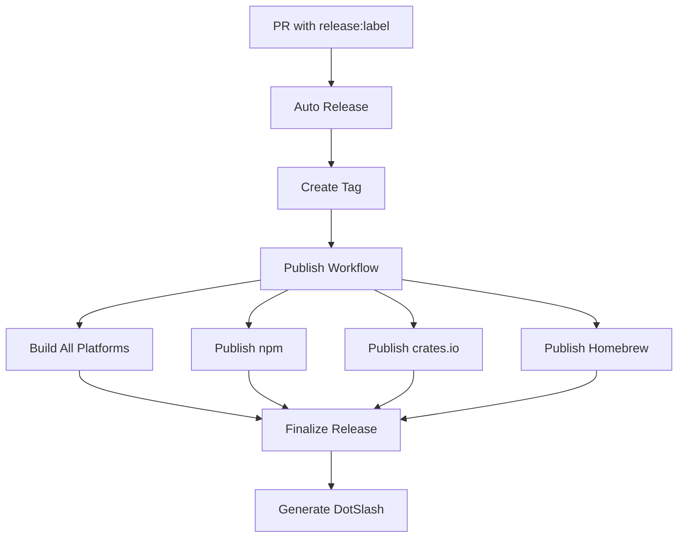

# GitHub Actions Workflows

This directory contains automated workflows for the blz Rust project, implementing a comprehensive CI/CD pipeline for building, testing, and publishing releases across multiple platforms.

## Workflow Architecture

### Release Pipeline Overview

The release system follows this flow:

1. **Auto Release Detection** (`auto-release.yml`) - Detects release labels on PRs and creates tags
2. **Main Release Build** (`publish.yml`) - Builds binaries and creates GitHub releases
3. **Registry Publishing** - Publishes to npm, crates.io, and Homebrew in parallel
4. **DotSlash Generation** (`generate-dotslash.yml`) - Creates DotSlash files after successful release



## Core Workflows

### 🏗️ Build & Release Workflows

#### publish.yml
**Purpose**: Main release workflow that orchestrates building, publishing, and finalizing releases

**Triggers**:
- Push to tags matching `v*` (automatic from `auto-release.yml`)
- Manual dispatch with tag parameter
- Workflow call from other workflows

**Key Features**:
- **Auto-publish**: Now automatically publishes draft releases (no manual intervention required)
- **Multi-platform builds**: Builds for macOS (arm64/x64), Linux (x64), and Windows (x64)
- **Parallel publishing**: npm, crates.io, and Homebrew publish concurrently
- **Semantic versioning**: Automatically determines dist-tag based on version format
- **Release notes**: Auto-generates release notes from PR associations

**Workflow Dispatch Parameters**:
- `tag` (required): Git tag to release (e.g., v0.2.0)
- `dist_tag` (optional): Override npm dist-tag (defaults based on version)

#### auto-release.yml
**Purpose**: Automatically creates releases when PRs with release labels are merged

**Triggers**:
- Push to main branch
- Pull request events (for label validation)

**Release Labels**:
- `release:major` - Major version bump (1.0.0 → 2.0.0)
- `release:minor` - Minor version bump (1.0.0 → 1.1.0)
- `release:patch` - Patch version bump (1.0.0 → 1.0.1)
- `release:canary` - Pre-release with timestamp
- `release:hold` - Pauses release automation

**Key Features**:
- **Semver bumping**: Uses `scripts/release/semver-bump.sh` for version management
- **Tag creation**: Automatically creates and pushes release tags
- **Skip conditions**: Respects `[skip release]` in commit messages
- **PR association**: Links releases to originating pull requests

#### reusable-build.yml / reusable-build-v2.yml
**Purpose**: Reusable workflow for building platform-specific binaries

**Platforms Supported**:
- `darwin-arm64` (macOS Apple Silicon)
- `darwin-x64` (macOS Intel)
- `linux-x64` (Linux x86_64)
- `windows-x64` (Windows x86_64)

**Features**:
- **Artifact caching**: Reduces build times with intelligent caching
- **Cross-compilation**: Supports building Linux targets on Ubuntu
- **Archive generation**: Creates appropriate archives (.tar.gz, .zip)

### 📦 Publishing Workflows

#### publish-npm.yml
**Purpose**: Publishes blz to npm registry as `@outfitter/blz`

**Features**:
- **Version validation**: Ensures package.json matches release tag
- **Duplicate prevention**: Skips publishing if version already exists
- **Dist-tag support**: Supports `latest`, `canary`, `beta`, `alpha`, `next`
- **Provenance**: Includes npm provenance attestation

**Workflow Dispatch Parameters**:
- `tag` (required): Git tag to publish
- `dist_tag` (optional): npm dist-tag override

#### publish-crates.yml
**Purpose**: Publishes Rust crates to crates.io

**Crates Published**:
1. `blz-core` (published first)
2. `blz-cli` (published after core propagates)

**Features**:
- **Dependency ordering**: Waits for blz-core to propagate before publishing blz-cli
- **Propagation verification**: Checks both cargo search and crates.io API
- **Version validation**: Ensures Cargo.toml versions match release tag
- **Retry logic**: Built-in retry for crates.io API calls

**Workflow Dispatch Parameters**:
- `tag` (required): Git tag to publish
- `propagation_attempts` (optional): Max attempts to verify propagation (default: 30)
- `propagation_delay_seconds` (optional): Delay between checks (default: 5)

#### publish-homebrew.yml
**Purpose**: Updates Homebrew tap with new release

**Repository**: `outfitter-dev/homebrew-tap`

**Features**:
- **Retry logic**: Robust retry mechanism for GitHub API calls (addresses transient failures)
- **Asset verification**: Confirms all required release assets are available
- **SHA256 computation**: Calculates checksums for macOS and Linux binaries
- **PR creation**: Automatically creates PR in tap repository
- **Multi-platform support**: Now includes Linux binaries for Homebrew on Linux

**Assets Required**:
- `blz-${version}-darwin-arm64.tar.gz`
- `blz-${version}-darwin-x64.tar.gz`
- `blz-${version}-linux-x64.tar.gz`

#### generate-dotslash.yml
**Purpose**: Generates DotSlash files after a release has been published

**Triggers**:
- `release` events with type `published`

**Features**:
- **Asset readiness check**: Waits for GitHub release assets to be available (with retries) before publishing DotSlash metadata
- **Release detection**: Uses the published release payload to determine the tag to process
- **DotSlash integration**: Uses Facebook's `dotslash-publish-release` action
- **Configuration**: Uses `.github/workflows/dotslash-config.json`

### 🧪 Development & CI Workflows

#### tests.yml
**Purpose**: Comprehensive test suite across multiple Rust versions and platforms

**Test Matrix**:
- Rust versions: stable, beta, nightly, MSRV
- Platforms: Ubuntu, macOS, Windows

**Test Types**:
- Unit tests (`cargo test`)
- Integration tests (`cargo nextest`)
- Documentation tests
- Benchmark validation

#### coverage.yml
**Purpose**: Code coverage reporting and enforcement

**Features**:
- **tarpaulin**: Uses cargo-tarpaulin for coverage collection
- **Coverage thresholds**: Enforces minimum coverage requirements
- **CLI coverage**: Special handling for CLI subcommand coverage, including hidden commands
- **Coverage reporting**: Uploads to Codecov

#### miri.yml
**Purpose**: Memory safety validation using Miri

**Features**:
- **Undefined behavior detection**: Catches memory safety violations
- **Unsafe code validation**: Ensures unsafe blocks are sound
- **Nightly toolchain**: Uses latest Miri capabilities

#### format-lint.yml
**Purpose**: Code formatting and linting enforcement

**Tools**:
- **rustfmt**: Code formatting validation
- **clippy**: Linting with workspace-configured rules
- **cargo-deny**: License and security validation
- **yaml-lint**: YAML workflow validation

### 🤖 AI Assistant Workflows

#### claude.yml
**Purpose**: Responds to explicit `@claude` mentions in pull requests

**Triggers**:
- PR comments with `@claude`
- PR review comments with `@claude`
- PR review submissions with `@claude`

**Capabilities**:
- Build and test execution
- Code analysis and suggestions
- Clippy compliance checking
- Test creation assistance

#### claude-code-review.yml
**Purpose**: Automated code review for pull requests

**Triggers**:
- PR opened (non-draft)
- Draft PR marked as ready
- Review requested on PR
- `@claude review` comment on PR

**Review Focus**:
- Rust idioms and best practices
- Memory safety patterns
- Performance considerations
- Test coverage
- Documentation completeness

### 🔧 Utility Workflows

#### dependencies.yml
**Purpose**: Dependency security and maintenance

**Schedule**: Weekly on Mondays + on Cargo.toml changes

**Checks**:
- Unused dependencies (cargo-shear)
- Security advisories (cargo-audit)
- License compliance (cargo-deny)
- Dependency review on PRs

#### yaml-lint.yml
**Purpose**: YAML workflow validation

**Tools**:
- `actionlint`: GitHub Actions workflow linting
- `yamllint`: General YAML validation

## Workflow Dependencies

### Reusable Workflows

- `reusable-build.yml` → `reusable-build-v2.yml`
- `build-platform.yml` (legacy, being phased out)

### Workflow Calls

- `publish.yml` calls:
  - `reusable-build.yml` (4x for different platforms)
  - `publish-npm.yml`
  - `publish-crates.yml`
  - `publish-homebrew.yml`

### Event Chains

1. PR merge → `auto-release.yml` → tag creation
2. Tag push → `publish.yml` → multi-platform builds + publishing
3. `publish.yml` success → `generate-dotslash.yml`

## Required Secrets

### GitHub Repository Secrets

- `CLAUDE_CODE_OAUTH_TOKEN` - Claude AI integration
- `NPM_TOKEN` - npm registry publishing
- `CARGO_REGISTRY_TOKEN` - crates.io publishing
- `HOMEBREW_TAP_TOKEN` - Homebrew tap updates (note: still required despite some documentation suggesting otherwise)

### Permissions

- `contents: write` - Release creation and tag management
- `pull-requests: read` - PR analysis for release notes
- `id-token: write` - npm provenance attestation
- `issues: write` - Release automation comments

## Manual Operations

### Manual Release

```bash
# Trigger manual release
gh workflow run publish.yml -f tag=v1.0.0

# Check status
gh run list --workflow=publish.yml
```

### Individual Publishing

```bash
# Publish only to npm
gh workflow run publish-npm.yml -f tag=v1.0.0

# Publish only to crates.io
gh workflow run publish-crates.yml -f tag=v1.0.0

# Publish only to Homebrew
gh workflow run publish-homebrew.yml -f tag=v1.0.0
```

## Troubleshooting

### Common Issues and Solutions

#### Draft Release Blocking
**Problem**: Draft releases prevent downstream workflows from finding assets
**Solution**: Now resolved with auto-publish feature in `publish.yml`
**Legacy**: Manually publish draft releases if using older workflow versions

#### Transient GitHub API Failures
**Problem**: GitHub API occasionally fails with 500/503 errors
**Solution**: Retry logic implemented in `publish-homebrew.yml` and `auto-release.yml`
**Workaround**: Re-run failed workflows

#### Homebrew Asset Missing
**Problem**: Homebrew workflow fails with "assets not ready"
**Symptoms**:
```
Homebrew assets not ready for v1.0.0 (arm64=0, x64=1, linux=1)
```
**Solutions**:
1. Wait for `publish.yml` to complete fully
2. Check GitHub release has all required assets
3. Re-run Homebrew workflow

#### Crates.io Propagation Timeout
**Problem**: blz-cli publish fails because blz-core hasn't propagated
**Symptoms**:
```
Timed out waiting for blz-core 1.0.0 after 30 attempts
```
**Solutions**:
1. Increase `propagation_attempts` parameter
2. Wait and re-run the workflow
3. Check crates.io status page

#### Coverage Test Failures with Hidden Commands
**Problem**: CLI tests fail when hidden subcommands aren't covered
**Solution**: Implemented in `coverage.yml` - preprocessor now handles hidden commands correctly
**Details**: See coverage workflow for CLI subcommand preprocessing

#### Missing Linux Assets in Homebrew
**Problem**: Homebrew on Linux users can't install
**Solution**: Recent updates include Linux x64 binaries in Homebrew formula
**Note**: Requires `blz-${version}-linux-x64.tar.gz` in GitHub releases

### Debug Commands

```bash
# Check workflow run logs
gh run view <run-id> --log

# List recent workflow runs
gh run list --workflow=publish.yml --limit=10

# Check release assets
gh release view v1.0.0 --json assets

# Validate release labels
gh pr view <pr-number> --json labels
```

## Maintenance Guidelines

### Regular Maintenance

1. **Weekly**: Review dependency security advisories
2. **Monthly**: Update GitHub Actions to latest versions
3. **Per Release**: Verify all publishing workflows complete successfully
4. **Quarterly**: Review and optimize build cache strategies

### Workflow Updates

When modifying workflows:

1. **Test locally** with `act` if possible:
   ```bash
   # Install act
   brew install act

   # Test workflow
   act -W .github/workflows/tests.yml
   ```

2. **Use workflow_dispatch** for testing:
   ```yaml
   on:
     workflow_dispatch:  # Add for testing
     push:
       branches: [main]
   ```

3. **Monitor Actions tab** for failures after deployment

4. **Lint workflows**:
   ```bash
   # Install actionlint
   brew install actionlint

   # Lint workflows
   actionlint .github/workflows/*.yml
   ```

### Version Management

- Use semantic versioning strictly
- Release labels determine bump type automatically
- Canary releases include timestamp for uniqueness
- Pre-releases skip Homebrew publishing

### Security Considerations

- All publishing workflows require appropriate registry tokens
- Secrets are scoped to minimum required permissions
- Workflow permissions follow principle of least privilege
- Third-party actions are pinned to specific versions

## Performance Optimization

### Caching Strategy

- **Rust builds**: Cached by target and Cargo.lock hash
- **Dependencies**: cargo-edit and other tools cached
- **Release artifacts**: Shared between workflows

### Parallel Execution

- Platform builds run in parallel
- Registry publishing runs concurrently
- Independent jobs minimize total pipeline time

### Resource Usage

- **Build time**: ~8-12 minutes for full release
- **Runner cost**: Optimized for GitHub-hosted runners
- **Cache effectiveness**: ~70% cache hit rate on incremental builds

## Notes

- All workflows use `actions/checkout@v4` for consistency
- Concurrency groups prevent duplicate runs and resource conflicts
- Error handling includes both immediate failures and graceful degradation
- Workflow dispatch enables manual intervention when needed
- Status reporting provides visibility into pipeline progress
