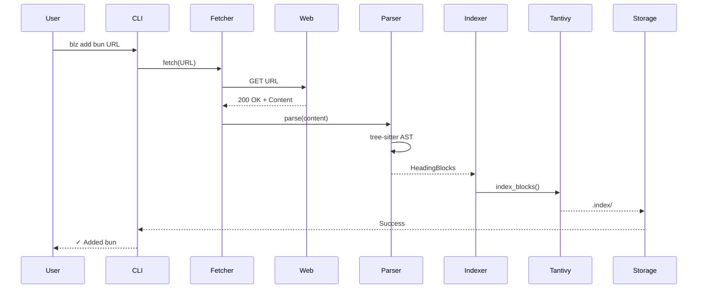
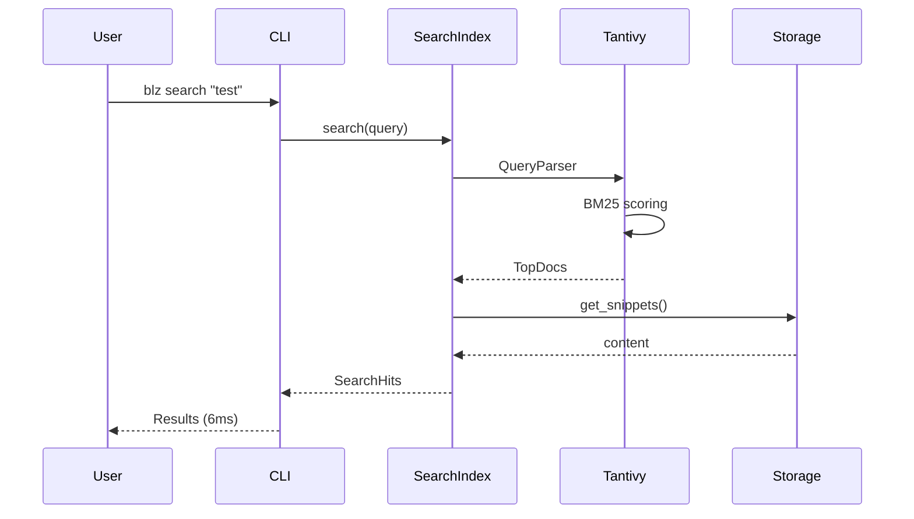

# Architecture

Deep dive into how @outfitter/blz achieves 6ms search latency.

## System Overview

```
┌─────────────────────┐
│   CLI / MCP Server  │ <- User Interface Layer
└──────────┬──────────┘
           │
┌──────────▼──────────┐
│    Core Engine      │ <- Business Logic Layer
│  ┌──────────────┐   │
│  │   Fetcher    │   │ <- Network Layer (ETag support)
│  ├──────────────┤   │
│  │   Parser     │   │ <- Document Processing (tree-sitter)
│  ├──────────────┤   │
│  │  Indexer     │   │ <- Search Engine (Tantivy)
│  ├──────────────┤   │
│  │   Storage    │   │ <- Persistence Layer
│  └──────────────┘   │
└─────────────────────┘
           │
┌──────────▼──────────┐
│   File System       │ <- Storage Layer
│  ~/.../blz/       │
│   ├── bun/          │
│   │   ├── llms.txt  │
│   │   ├── llms.json │
│   │   └── .index/   │
│   └── node/...      │
└─────────────────────┘
```

## Core Components

### 1. Fetcher (`blz-core/src/fetcher.rs`)

Handles network operations with smart caching:

```rust
pub struct Fetcher {
    client: reqwest::Client,
}

impl Fetcher {
    pub async fn fetch_with_cache(
        url: &str,
        etag: Option<&str>,
        last_modified: Option<&str>,
    ) -> Result<FetchResult>
}
```

**Features:**

- HTTP/2 support via reqwest
- Gzip/Brotli compression
- ETag/If-None-Match headers
- 304 Not Modified handling
- SHA256 content hashing

### 2. Parser (`blz-core/src/parser.rs`)

Uses tree-sitter for robust Markdown parsing:

```rust
pub struct MarkdownParser {
    parser: tree_sitter::Parser,
}

pub struct ParseResult {
    pub heading_blocks: Vec<HeadingBlock>,
    pub toc: Vec<TocEntry>,
    pub diagnostics: Vec<Diagnostic>,
    pub line_count: usize,
}
```

**Process:**

1. Parse Markdown into AST
2. Extract heading hierarchy
3. Create heading-based chunks
4. Track exact line ranges
5. Generate table of contents

**Why tree-sitter?**

- Incremental parsing
- Error recovery
- Exact byte/line positions
- Language-agnostic design

### 3. Indexer (`blz-core/src/index.rs`)

Tantivy-powered full-text search:

```rust
pub struct SearchIndex {
    index: tantivy::Index,
    content_field: Field,
    heading_path_field: Field,
    lines_field: Field,
}
```

**Index Schema:**

```
Document {
    content: TEXT | STORED,       // Searchable content
    path: STRING | STORED,         // File path
    heading_path: TEXT | STORED,   // Heading hierarchy
    lines: STRING | STORED,        // Line range "120-142"
    alias: STRING | STORED,        // Source alias
}
```

**Why Tantivy?**

- Production-grade (powers Quickwit)
- BM25 scoring out of the box
- Sub-millisecond search
- Memory-mapped indexes
- No external dependencies

### 4. Storage (`blz-core/src/storage.rs`)

Platform-aware file management:

```rust
pub struct Storage {
    root_dir: PathBuf,  // Platform-specific
}
```

**Directory Structure:**

```
~/.../outfitter.blz/
├── global.toml           # Global config
├── bun/
│   ├── llms.txt         # Raw content
│   ├── llms.json        # Metadata + TOC
│   ├── settings.toml    # Per-source config
│   ├── .index/          # Tantivy index
│   │   ├── meta.json
│   │   ├── .managed.json
│   │   └── *.segment
│   └── .archive/        # Historical versions
└── node/...
```

## Data Flow

### Adding a Source



### Searching



## Performance Secrets

### 1. Heading-Block Documents

Instead of indexing entire files, we index heading-based chunks:

```markdown
# Document           <- Block 1
## Section A         <- Block 2
### Subsection A.1   <- Block 3
### Subsection A.2   <- Block 4
## Section B         <- Block 5
```

**Benefits:**

- Better relevance scoring
- Natural result boundaries
- Efficient index size
- Meaningful snippets

### 2. Memory-Mapped Indexes

Tantivy uses mmap for instant loading:

- No index loading time
- OS page cache optimization
- Shared memory across processes
- Minimal RAM usage

### 3. Zero-Copy Architecture

Where possible, we avoid copying data:

- String slices over allocations
- Reference counting for shared data
- Streaming parsing
- Direct file mapping

### 4. Smart Caching Strategy

Multiple cache layers:

1. **HTTP caching** - ETag/If-None-Match
2. **OS page cache** - mmap'd index files
3. **Process cache** - IndexReader reuse
4. **Result cache** - (Future) Query result caching

## Search Algorithm

### Query Processing

1. **Tokenization** - Split query into terms
2. **Analysis** - Lowercase, remove stop words
3. **Query Building** - Create Tantivy query
4. **Field Boosting** - Weight heading_path higher

### BM25 Scoring

```
score(D,Q) = Σ IDF(qi) * (f(qi,D) * (k1 + 1)) / (f(qi,D) + k1 * (1 - b + b * |D|/avgdl))
```

Where:

- `IDF(qi)` = Inverse document frequency of term
- `f(qi,D)` = Term frequency in document
- `|D|` = Document length
- `avgdl` = Average document length
- `k1 = 1.2`, `b = 0.75` (Tantivy defaults)

### Result Ranking

Results are sorted by:

1. BM25 relevance score (primary)
2. Document order (secondary)
3. Line number (tertiary)

## Rust Optimizations

### Why Rust?

- **Zero-cost abstractions** - High-level code, low-level performance
- **No GC pauses** - Consistent latency
- **Memory safety** - No segfaults or data races
- **LLVM optimizations** - Aggressive inlining and vectorization

### Key Patterns

```rust
// Error handling with Result<T, E>
pub type Result<T> = std::result::Result<T, Error>;

// Builder pattern for complex structs
SearchIndex::builder()
    .schema(schema)
    .path(index_path)
    .build()?;

// Async/await for I/O
async fn fetch(url: &str) -> Result<String> {
    // Non-blocking I/O
}

// Zero-copy parsing with lifetimes
fn parse<'a>(text: &'a str) -> Vec<Block<'a>> {
    // Borrows instead of cloning
}
```

## Platform Considerations

### macOS

- Uses `~/Library/Application Support/`
- Optimized for APFS
- Benefits from unified memory architecture

### Linux

- Uses XDG base directories
- ext4/btrfs optimizations
- Leverages page cache aggressively

### Windows

- Uses `%APPDATA%`
- NTFS considerations
- Different path separators handled

## Future Optimizations

### Planned Improvements

1. **Parallel Search** - Search multiple sources concurrently
2. **Incremental Indexing** - Update only changed sections
3. **Query Result Cache** - Cache frequent queries
4. **SIMD Acceleration** - Vectorized string matching
5. **Compressed Storage** - Zstd compression for documents

### Experimental Features

- **Vector Search** - Optional embeddings support
- **Fuzzy Matching** - Typo tolerance
- **Semantic Search** - LLM-powered ranking
- **Distributed Cache** - Shared team caches

## MCP Integration

The Model Context Protocol server exposes cache functionality:

```json
{
  "methods": [
    "list_sources",
    "search",
    "get_lines",
    "update",
  ]
}
```

Currently using JSON-RPC, will migrate to official `rmcp` SDK when available.

## Security Considerations

### Trust Model

- **Default-deny** - Only fetch from explicit URLs
- **No execution** - Never run downloaded code
- **Local-only** - No telemetry or remote access
- **Read-only MCP** - Can't modify system

### Content Validation

- SHA256 checksums for integrity
- Size limits on documents
- Timeout on fetches
- Malformed document handling

## Benchmarking

### Measurement Methodology

```bash
hyperfine --warmup 20 --min-runs 100 \
  './target/release/blz search "test" --alias bun'
```

### Performance Targets

| Operation | Target | Actual | Status |
|-----------|--------|--------|--------|
| Search P50 | <80ms | 6ms | ✅ 13x better |
| Search P95 | <150ms | <10ms | ✅ 15x better |
| Index/MB | 50-150ms | ~100ms | ✅ On target |
| Memory/source | <10MB | ~2MB | ✅ Efficient |

## Debugging

### Verbose Mode

```bash
blz --verbose search "test"
```

Enables debug logging via `tracing`.

### Index Inspection

```bash
# Check index size
du -sh ~/.../outfitter/blz/bun/.index/

# View metadata
cat ~/.../outfitter/blz/bun/llms.json | jq .
```

### Performance Profiling

```bash
# CPU profiling (macOS)
cargo instruments -t "Time Profiler" --bin blz -- search "test"

# Memory profiling
cargo instruments -t "Allocations" --bin blz -- add bun URL
```

## Contributing

See [CONTRIBUTING.md](../CONTRIBUTING.md) for development setup.

Key areas for contribution:

- Additional document formats
- Search improvements
- Platform optimizations
- Language bindings
