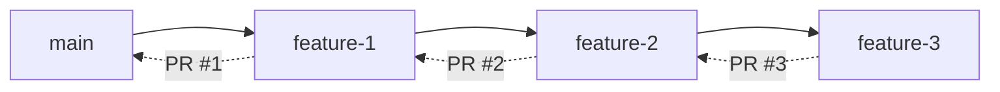

# Development Workflow

This document describes our development workflow, tools, and processes for the BLZ project.

## Workflow Overview

We follow a **trunk-based development** model with **stacked PRs** using Graphite:



## Graphite Workflow

### Why Graphite?

- **Smaller PRs**: Break large changes into reviewable chunks
- **Faster reviews**: Each PR focuses on one concern
- **Parallel development**: Work on multiple features simultaneously
- **Better CI efficiency**: Graphite optimizes which tests to run

### Core Commands

```bash
# Start your day - sync with latest main
gt sync --no-interactive

# Check your current stack
gt log

# Create a new branch for your work
gt create -m "feat: add search caching"

# Make changes and stage them
git add -A

# Amend current branch (instead of new commit)
gt modify -a

# Create another branch stacked on top
gt create -m "test: add cache tests"

# Submit your entire stack as PRs
gt submit --no-interactive

# Navigate your stack
gt up     # Go to branch above
gt down   # Go to branch below
gt trunk  # Go back to main
```

### Advanced Stack Management

```bash
# Split a branch with multiple commits
gt split --by-commit

# Squash all commits in current branch
gt squash

# Fold branch into its parent
gt fold

# Reorder branches in your stack
gt move <branch> --onto <target>

# Cherry-pick changes between branches
gt copy <commit> --onto <branch>
```

## Daily Workflow

### Morning Routine

1. **Sync with upstream**:

   ```bash
   gt sync --no-interactive --force
   ```

2. **Check CI status**:

   ```bash
   gh pr status
   ```

3. **Review feedback**:
   - Check PR comments
   - Review Claude's automated feedback
   - Address any failing checks

### Development Cycle

1. **Plan your work**:
   - Break feature into small, logical pieces
   - Each piece should be independently reviewable

2. **Create your stack**:

   ```bash
   # First PR: Core implementation
   gt create -m "feat: implement base functionality"
   # ... make changes ...
   
   # Second PR: Tests
   gt create -m "test: add comprehensive tests"
   # ... add tests ...
   
   # Third PR: Documentation
   gt create -m "docs: update documentation"
   # ... update docs ...
   ```

3. **Iterate on feedback**:

   ```bash
   # Check out the branch that needs changes
   gt checkout <branch-name>
   
   # Make requested changes
   # ... edit files ...
   
   # Amend the changes
   gt modify -a
   
   # Update the PR
   gt submit --no-interactive
   ```

### End of Day

1. **Submit any pending work**:

   ```bash
   gt submit --no-interactive --draft
   ```

2. **Clean up merged branches**:

   ```bash
   gt sync --force
   ```

## Code Review Process

### As an Author

1. **Self-review first**: Review your own PR before requesting reviews
2. **Provide context**: Write clear PR descriptions
3. **Respond promptly**: Address feedback within 24 hours
4. **Update thoroughly**: Don't just fix the immediate issue

### As a Reviewer

1. **Review promptly**: Aim to review within 4 hours during work hours
2. **Be constructive**: Suggest improvements, don't just criticize
3. **Consider the bigger picture**: How does this fit the overall architecture?
4. **Approve or request changes**: Don't leave reviews in limbo

### Automated Reviews

Our automated reviewers help catch common issues:

- **Claude**: Code quality, best practices, security concerns
- **CodeRabbit**: Additional static analysis
- **GitHub Actions**: Linting, formatting, tests

Treat automated feedback seriously, but use judgment - tools can be wrong.

## Branch Naming Conventions

```bash
# Format: <date>-<type>_<issue>_<description>

# Examples:
08-29-feat_23_add_quiet_mode
08-29-fix_42_prevent_pagination_panic
08-29-docs_37_update_readme
08-29-refactor_cleanup_unused_code

# Types:
feat     # New feature
fix      # Bug fix
docs     # Documentation
test     # Tests
refactor # Code restructuring
perf     # Performance
ci       # CI/CD changes
chore    # Maintenance
```

## Debugging Workflow

### Local Debugging

1. **Enable debug logging**:

   ```bash
   RUST_LOG=debug cargo run -- search "test"
   ```

2. **Use debug assertions**:

   ```rust
   debug_assert!(condition, "Message");
   ```

3. **Run specific test with output**:

   ```bash
   cargo test test_name -- --nocapture
   ```

### Performance Debugging

1. **Generate flamegraph**:

   ```bash
   cargo flamegraph --bin blz -- search "rust"
   ```

2. **Run benchmarks**:

   ```bash
   cargo bench
   ```

3. **Check memory usage**:

   ```bash
   /usr/bin/time -l cargo run -- search "test"
   ```

## Release Process

### Release Automation (release-please)

1. Merge conventional commits into `main`.
2. release-please opens or updates the release PR.
3. Merge the release PR to create the tag and draft release.
4. `publish.yml` runs on the tag to upload assets and publish registries.

For canary releases, merge into `release-canary` and follow the same flow.

### Release Checklist

- [ ] All tests passing
- [ ] Documentation updated
- [ ] Release-please PR merged
- [ ] Publish workflow completed
- [ ] Security audit clean
- [ ] Performance benchmarks acceptable

### Semantic Versioning

We follow [SemVer](https://semver.org/):

- **MAJOR**: Breaking API changes
- **MINOR**: New features, backward compatible
- **PATCH**: Bug fixes, backward compatible

## Troubleshooting

### Common Issues

#### Graphite Sync Conflicts

```bash
# If sync has conflicts
gt sync --no-interactive

# Fix conflicts in your editor
# Then continue
gt continue
```

#### Stale Branches

```bash
# Remove merged branches
gt sync --force

# Or manually
gt branch delete <branch-name>
```

#### CI Failures

1. Check Graphite dashboard for skip rules
2. Verify GitHub Actions logs
3. Run checks locally to reproduce

### Getting Unstuck

If you get into a bad state:

```bash
# Save your work
git stash

# Reset to clean state
gt trunk
git reset --hard origin/main

# Reapply work carefully
git stash pop
```

## Tools and Resources

### Essential Tools

- **Graphite CLI**: Stack management
- **GitHub CLI**: PR management (`gh`)
- **Rust Analyzer**: IDE support
- **cargo-watch**: Auto-rebuild on changes

### Helpful Aliases

Add to your shell config:

```bash
# Graphite shortcuts
alias gs='gt sync --no-interactive'
alias gl='gt log'
alias gta='gt modify -a'
alias gts='gt submit --no-interactive'

# Cargo shortcuts
alias cb='cargo build --release'
alias ct='cargo test --workspace'
alias cc='cargo clippy --workspace -- -D warnings'
alias cf='cargo fmt'
```

### Learning Resources

- [Graphite Docs](https://graphite.dev/docs)
- [Graphite Video Tutorials](https://graphite.dev/guides)
- [Project Guidelines](../../.agents/rules/DEVELOPMENT.md)
- [Rust Book](https://doc.rust-lang.org/book/)

## Questions?

- Check [existing issues](https://github.com/outfitter-dev/blz/issues)
- Ask in a new discussion
- Review our [contributing guide](./contributing.md)
